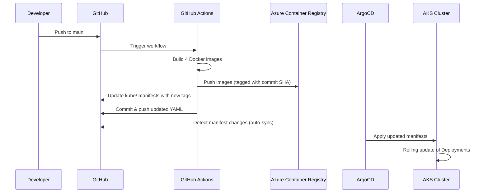

# Disaster Relief Platform — Architecture

## System Overview

A cloud-native microservices platform for real-time disaster relief coordination, deployed on **Azure Kubernetes Service (AKS)** via **ArgoCD GitOps**.

```mermaid
graph TB
    subgraph "End Users"
        Browser["Browser / Mobile"]
    end

    subgraph "AKS Cluster"
        FE["Frontend<br/>(React + NGINX)"]
        AA["Alert API<br/>(FastAPI)"]
        RA["Resource API<br/>(Express)"]
        NW["Notification Worker<br/>(Go)"]
        RD[(Redis)]
        PG[(PostgreSQL)]
    end

    subgraph "Monitoring"
        PT["Promtail<br/>(DaemonSet)"]
        LK["Loki"]
        PM["Prometheus"]
    end

    Browser -->|HTTPS| FE
    FE -->|/api/alerts| AA
    FE -->|/api/resources| RA
    AA --> RD
    RA --> PG
    NW -->|polls /alerts| AA
    PT -->|logs| LK
    PM -->|scrapes /metrics| AA
    PM -->|scrapes /metrics| RA
```



---

## Microservices

| Service | Language | Port | Connects To | Purpose |
|---------|----------|------|-------------|---------|
| **frontend** | React / NGINX | 80 | alert-api, resource-api (via reverse-proxy) | Public dashboard showing active alerts and resource inventory |
| **alert-api** | Python / FastAPI | 8000 | Redis | Ingest and broadcast emergency alerts; caches in Redis |
| **resource-api** | Node.js / Express | 3000 | PostgreSQL | Manage relief supply inventories (CRUD) |
| **notification-worker** | Go | — | alert-api (HTTP polling) | Background worker simulating SMS/Email dispatch |

### Data Stores

- **Redis 7** — StatefulSet with 1 Gi PVC; caches active alerts for fast reads.
- **PostgreSQL 16** — StatefulSet with 5 Gi PVC; stores resource inventory data. Password managed via Kubernetes Secret.

---

## Communication Patterns

1. **Frontend → Backend**: NGINX reverse-proxies `/api/alerts` to `alert-api-service:8000` and `/api/resources` to `resource-api-service:3000`.
2. **Alert API → Redis**: Direct TCP connection for cache reads/writes.
3. **Resource API → PostgreSQL**: `pg` pool via `postgres-service:5432` with auto-table creation on startup.
4. **Notification Worker → Alert API**: HTTP polling every 10 seconds; deduplicates by alert ID.

---

## GitOps Deployment Flow



### Key GitOps Principles

- **Single source of truth**: All Kubernetes configs live in `kube/`.
- **Declarative**: ArgoCD compares desired state (Git) with live state (cluster) and reconciles.
- **Automated sync**: ArgoCD auto-syncs with `prune` and `selfHeal` enabled — no manual `kubectl apply` needed.
- **Image tagging**: Each build uses the Git commit SHA as the image tag, ensuring full traceability.

---

## Monitoring Stack

| Component | Type | Purpose |
|-----------|------|---------|
| **Prometheus** | Annotation-based scraping | Collects `/metrics` from all app pods via `prometheus.io/*` annotations |
| **Promtail** | DaemonSet | Ships container logs from every node to Loki |
| **Loki** | (External/separate deploy) | Aggregates logs for querying via Grafana |

All four application Deployments include Prometheus scraping annotations:

```yaml
annotations:
  prometheus.io/scrape: "true"
  prometheus.io/port: "<service-port>"
  prometheus.io/path: "/metrics"
```

---

## Repository Structure

```
├── argocd-app.yaml              # ArgoCD Application CR
├── src/
│   ├── frontend/                # React + NGINX (Dockerfile)
│   ├── alert-api/               # FastAPI + Redis (Dockerfile)
│   ├── resource-api/            # Express + PostgreSQL (Dockerfile)
│   └── notification-worker/     # Go (Dockerfile)
├── kube/                        # All Kubernetes manifests
│   ├── frontend-deployment.yaml
│   ├── alert-api-deployment.yaml
│   ├── resource-api-deployment.yaml
│   ├── notification-worker-deployment.yaml
│   ├── redis-statefulset.yaml
│   └── postgres-statefulset.yaml
├── cicd/.github/workflows/
│   └── main.yml                 # GitHub Actions CI/CD
├── monitoring/
│   └── promtail-daemonset.yaml  # Promtail DaemonSet + RBAC
├── infrastructure/              # (Existing Terraform — not managed here)
└── docs/
    └── architecture.md          # This file
```

---

## Configuration & Secrets

| Secret / Config | How Used |
|-----------------|----------|
| `postgres-secret` | Kubernetes Secret storing `POSTGRES_PASSWORD`; referenced by both the PostgreSQL StatefulSet and the Resource API Deployment |
| `ACR_NAME` | GitHub repo secret consumed by the CI/CD workflow for ACR authentication |
| `AZURE_CREDENTIALS` | GitHub repo secret for `azure/login` Action |
| `REDIS_HOST` / `REDIS_PORT` | Environment variables injected into alert-api pods |
| `ALERT_API_URL` | Environment variable injected into notification-worker pods |
